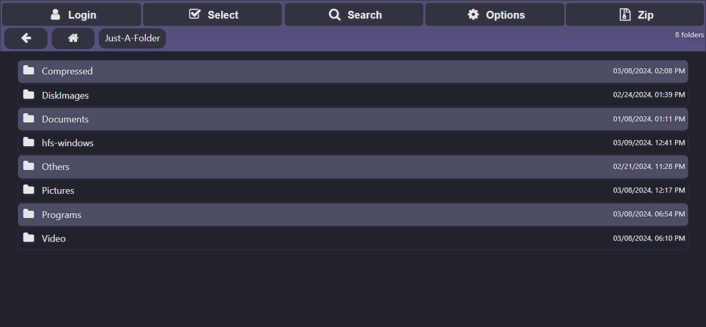

# Dracula Theme for HFS 3

## Introduction

_This is Dracula theme for HTTP File Server (HFS) version 3. This theme is inspired by the famous Dracula color scheme, known for its dark and elegant hues that are easy on the eyes. It's perfect for those who enjoy working in a dark environment or simply love the Dracula aesthetic._

## Screenshot



## Installation

_To install the Dracula theme for HFS 3, please follow these steps:_

1. _Download this repository or clone it using Git with the following command:_

   ```bash
   git clone --depth 1 https://github.com/TechWhizKid/hfs-dracula-theme.git
   ```

2. _Navigate to the downloaded or cloned repository folder._
3. _Copy the `dist` folder from the repository into the `plugins` folder of your HFS installation directory._
4. _Open the HFS admin panel in your web browser._
5. _Go to the 'Plugins' section and activate the Dracula theme._

## Customization

_The theme is designed with customization in mind. You can easily modify the color variables in the `:root` section of the CSS file to adjust the theme to your liking._

---

<p align="center">Enjoy your dark mode experience with the Dracula theme for HFS 3!</p>

---
